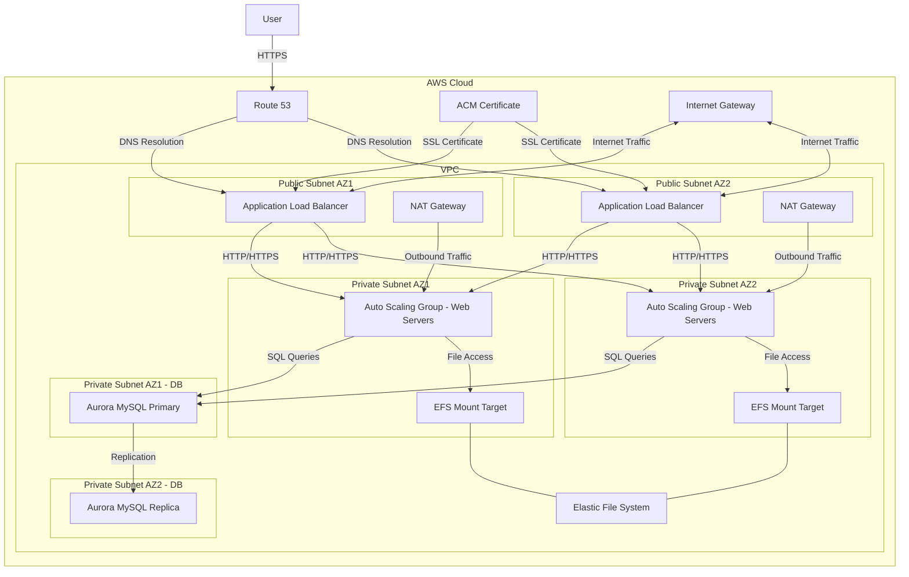

# AWS LAMP Stack Deployment with Ansible

This project provides a complete set of Ansible playbooks and roles to deploy a scalable LAMP (Linux, Apache, MySQL, PHP) stack on AWS. The infrastructure is designed to be highly available, secure, and scalable.

## Architecture

> This section was generated using Cline and mcp-ansible.

The deployed architecture includes:

- VPC with public and private subnets across multiple availability zones
- Auto Scaling Group for web servers in private subnets
- Aurora MySQL database cluster for high availability
- Application Load Balancer in public subnets
- EFS for shared storage between web servers
- Security groups for controlled access
- Route 53 for DNS management
- ACM for SSL/TLS certificates



## Prerequisites

- AWS account with appropriate permissions
- Ansible 2.9 or higher
- Python 3.6 or higher
- AWS CLI configured with appropriate credentials
- (Optional) LocalStack for local testing

## Directory Structure

```
aws-lamp-stack/
├── ansible.cfg                  # Ansible configuration
├── inventory/                   # Inventory files
│   ├── aws_hosts.yml            # AWS inventory
│   └── localstack_hosts.yml     # LocalStack inventory
├── group_vars/                  # Group variables
│   ├── all.yml                  # Common variables
│   ├── aws.yml                  # AWS-specific variables
│   └── localstack.yml           # LocalStack-specific variables
├── playbooks/                   # Playbooks
│   ├── main.yml                 # Main playbook
│   ├── vpc.yml                  # VPC setup
│   ├── security.yml             # Security groups
│   ├── efs.yml                  # EFS setup
│   ├── rds.yml                  # RDS/Aurora setup
│   ├── ec2.yml                  # EC2 instances setup
│   ├── loadbalancer.yml         # Load balancer setup
│   └── dns_ssl.yml              # DNS and SSL setup
└── roles/                       # Roles
    ├── common/                  # Common configuration
    ├── web/                     # Web server configuration
    ├── db/                      # Database configuration
    └── efs/                     # EFS configuration
```

## Configuration

Before running the playbooks, you need to configure the variables in the `group_vars` directory:

1. Edit `group_vars/all.yml` to set common variables like project name, region, etc.
2. Edit `group_vars/aws.yml` for AWS-specific configuration
3. Edit `group_vars/localstack.yml` for LocalStack testing configuration

## Usage

### Deploying to AWS

```bash
# Set environment to AWS
export ENVIRONMENT=aws

# Run the main playbook
ansible-playbook playbooks/main.yml
```

### Testing with LocalStack

```bash
# Set environment to LocalStack
export ENVIRONMENT=localstack

# Run the main playbook
ansible-playbook playbooks/main.yml
```

### Running Individual Playbooks

You can also run individual playbooks if needed:

```bash
# Just set up the VPC
ansible-playbook playbooks/vpc.yml

# Just set up the database
ansible-playbook playbooks/rds.yml
```

## Customization

### Adding Custom Application Code

To deploy your own application instead of the demo app:

1. Set `app_git_repo` in `group_vars/all.yml` to your Git repository URL
2. Set `app_version` to the branch, tag, or commit to deploy
3. Run the playbooks as usual

### Modifying Infrastructure

To modify the infrastructure:

1. Edit the relevant playbook in the `playbooks` directory
2. Update variables in `group_vars` as needed
3. Run the playbooks to apply changes

## Cleanup

To clean up all resources created by these playbooks:

```bash
# Set environment
export ENVIRONMENT=aws  # or localstack

# Run cleanup playbook
ansible-playbook playbooks/cleanup.yml
```

## Testing

The project includes integration with LocalStack for local testing without incurring AWS costs. To use LocalStack:

1. Install and start LocalStack
2. Set `ENVIRONMENT=localstack`
3. Run the playbooks as usual

For convenience, you can use the provided test script:

```bash
./test_with_localstack.sh
```

See the [LOCALSTACK_COMPATIBILITY.md](LOCALSTACK_COMPATIBILITY.md) file for details on LocalStack compatibility improvements.

## Security Considerations

- All sensitive data is stored in encrypted form
- Security groups are configured with least privilege access
- SSL/TLS is enforced for all public endpoints
- Database credentials are generated randomly if not provided

## Contributing

Contributions are welcome! Please feel free to submit a Pull Request.

## License

This project is licensed under the MIT License - see the LICENSE file for details.
