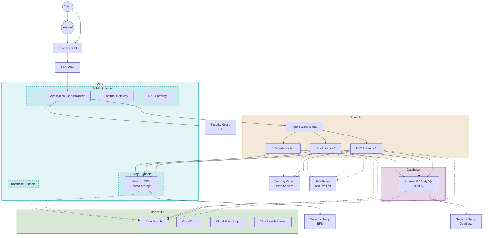

# AWS LAMP Stack Infrastructure

A secure, scalable, and highly available LAMP (Linux, Apache, MySQL, PHP) stack infrastructure on AWS using Terraform for infrastructure provisioning and Ansible for configuration management.

## Architecture



This project implements a complete LAMP stack with the following components:

### Core Components

- Apache web servers running on Amazon Linux 2 in an Auto Scaling Group (ASG)
- PHP and MySQL client installed via Ansible
- Amazon RDS (MySQL) for the database backend
- EFS (Elastic File System) mounted to each web server instance
- Application Load Balancer (ALB) distributing traffic across the web servers

### Networking & DNS

- VPC with public and private subnets across multiple Availability Zones
- Internet Gateway and NAT Gateway
- Route53 hosted zone with DNS records pointing to the ALB

### Security & Monitoring

- AWS WAF attached to the ALB to filter traffic
- IAM roles with least-privilege access for EC2, EFS, and RDS usage
- AWS CloudTrail enabled for audit logging
- CloudWatch Logs enabled for EC2 and RDS monitoring
- Security Groups and NACLs configured for least-privilege access

### High Availability

- Deployment across multiple AZs
- Health checks on ALB
- Auto-scaling policies based on CPU and memory utilization

## Project Structure

```
aws-terraform-lamp/
├── terraform/                  # Terraform infrastructure code
│   ├── modules/                # Modular Terraform components
│   │   ├── networking/         # VPC, subnets, NAT, IGW
│   │   ├── security/           # Security groups, IAM roles
│   │   ├── storage/            # EFS configuration
│   │   ├── database/           # RDS configuration
│   │   ├── compute/            # EC2, ASG configuration
│   │   ├── loadbalancing/      # ALB configuration
│   │   ├── dns/                # Route53 configuration
│   │   ├── waf/                # WAF configuration
│   │   └── monitoring/         # CloudWatch, CloudTrail configuration
│   ├── main.tf                 # Main Terraform configuration
│   ├── variables.tf            # Input variables
│   ├── outputs.tf              # Output values
│   └── terraform.tfvars        # Variable values
├── ansible/                    # Ansible configuration code
│   ├── roles/                  # Ansible roles
│   │   ├── common/             # Common server configuration
│   │   ├── web/                # Apache and PHP configuration
│   │   ├── efs_client/         # EFS mount configuration
│   │   ├── db_client/          # MySQL client configuration
│   │   └── app/                # Application deployment
│   ├── inventory/              # Inventory files
│   │   ├── aws_ec2.yml         # Dynamic AWS inventory
│   │   └── localstack.yml      # LocalStack inventory for testing
│   ├── group_vars/             # Group variables
│   │   ├── all.yml             # Variables for all hosts
│   │   └── web_servers.yml     # Variables for web servers
│   ├── site.yml                # Main playbook
│   └── ansible.cfg             # Ansible configuration
├── deploy_to_aws.sh            # Deployment script
├── test_with_localstack.sh     # Testing script with LocalStack
└── cleanup_aws.sh              # Resource cleanup script
```

## Prerequisites

- AWS CLI configured with appropriate credentials
- Terraform >= 1.0.0
- Ansible >= 2.9.0
- LocalStack (for local testing)
- jq (for JSON processing)

## Usage

### Local Testing with LocalStack

To test the infrastructure locally using LocalStack:

```bash
# Start LocalStack
localstack start

# Run the test script
./test_with_localstack.sh
```

### Deploying to AWS

To deploy the infrastructure to AWS:

```bash
# Set AWS credentials
export AWS_ACCESS_KEY_ID="your-access-key"
export AWS_SECRET_ACCESS_KEY="your-secret-key"
export AWS_REGION="us-west-2"

# Run the deployment script
./deploy_to_aws.sh
```

### Cleaning Up Resources

To clean up all AWS resources created by this project:

```bash
# Set AWS credentials (if not already set)
export AWS_ACCESS_KEY_ID="your-access-key"
export AWS_SECRET_ACCESS_KEY="your-secret-key"
export AWS_REGION="us-west-2"

# Run the cleanup script
./cleanup_aws.sh
```

## Customization

### Terraform Variables

Edit `terraform/terraform.tfvars` to customize the infrastructure:

```hcl
# Example customization
aws_region     = "us-east-1"
vpc_cidr       = "10.0.0.0/16"
instance_type  = "t3.small"
rds_instance_class = "db.t3.small"
domain_name    = "example.com"
```

### Ansible Variables

Edit files in `ansible/group_vars/` to customize the configuration:

```yaml
# Example customization in group_vars/all.yml
environment: production
timezone: America/New_York
php_memory_limit: 256M
```

## Security Features

- All data in transit is encrypted using TLS
- All data at rest is encrypted using AWS KMS
- Web Application Firewall (WAF) protects against common web exploits
- Security groups follow the principle of least privilege
- IAM roles are scoped to minimum required permissions
- SSH access is restricted and password authentication is disabled
- CloudTrail logs all API calls for audit purposes

## Monitoring and Logging

- CloudWatch Logs collect and centralize logs from EC2 instances
- CloudWatch Alarms monitor resource utilization and trigger scaling
- CloudTrail logs all API calls for audit and compliance
- Health checks ensure services are functioning properly

## License

This project is licensed under the MIT License - see the LICENSE file for details.
